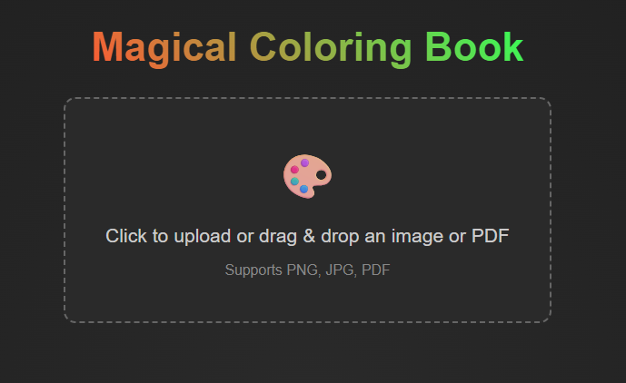
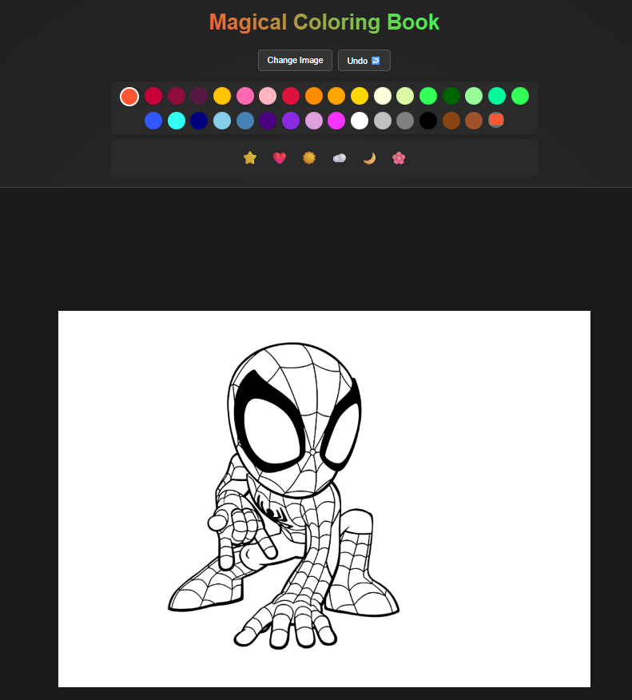
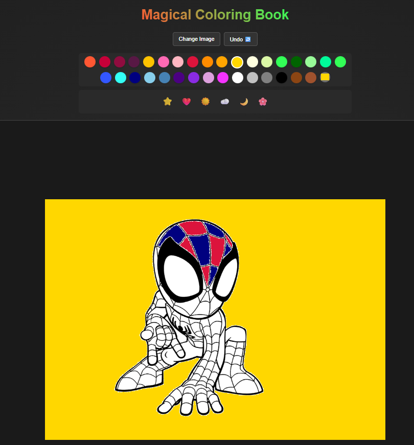

# 🎨 Magical Coloring Book

An interactive, high-end coloring book application built with React and Vite. Upload your favorite coloring pages (images or PDFs) and bring them to life with vibrant colors and fun stickers!

## ✨ Features

- **Multi-format Support**: Upload PNG, JPG, or even **PDF** files directly.
- **Smart Fill**: Intuitive flood-fill tool for easy coloring.
- **Creative Stickers**: Add a variety of colorful stickers to your masterpiece.
- **Undo System**: Made a mistake? No problem! Easily undo your last actions.
- **Premium UI**: Sleek, modern interface with smooth transitions and a dark-themed aesthetic.

## 🚀 Getting Started

### Prerequisites

- [Node.js](https://nodejs.org/) (v18.0.0 or higher recommended)
- npm (comes with Node.js)

### Installation

1. Clone the repository:
   ```bash
   git clone https://github.com/YOUR_USERNAME/my-coloring.git
   cd Coloring-Book
   ```

2. Install dependencies:
   ```bash
   npm install
   ```

### Running the App

Start the development server:
```bash
npm run dev
```
Open your browser to the URL provided in the terminal (usually `http://localhost:5050`).

## 🛠️ Built With

- **React** - Frontend framework
- **Vite** - Super fast build tool and dev server
- **PDF.js** - For handling PDF uploads and rendering
- **HTML5 Canvas API** - Core drawing and fill logic
- **Inter Font** - For a modern, clean look


## 📸 Screenshots

<p align="center">
  
  
  
</p>

## 📝 License

This project is open-source and available under the [MIT License](LICENSE).
